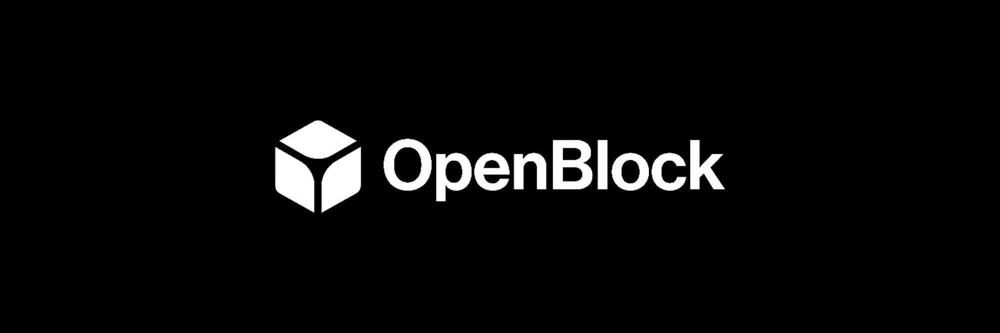

# OpenBlock Labs Schemas

Welcome to OpenBlock Lab's canonical schema repository!

## About

This repository will house the source of truth for our externally facing standard schema. You can think of this is a base layer schema for any protocol to follow. In turn, this integrates into our products seamlessly. 

- There is a schema, tables / entities for each protocol vertical.
- Each protocol vertical schema has a version following [semver](https://semver.org/).
- Schemas can be programatically accessed in this repository.
- These schemas can support non-breaking additions to any base schema. This may be required for some analytics.
- If you are unable to retrieve certain fields for your protocol, please mark them as null in data returned to us.
- When providing data, please name fields/columns in the proper generic convention (ie, snake_case for SQL, camelCase for GraphQL).

### Feedback

We are always looking for feedback to make this whole process better.

- Are the fields reasonable to collect?
- Are descriptions clear?
- Do certain fields fit better in different tables?
- Would you add or remove anything?

## Schemas

Below you will find links to each of the following verticals.

- General
- [DEX](./schemas/dex/SCHEMA.md) (Decentralized Exchange)
- [Lending](./schemas/lending/SCHEMA.md) / MM (Money Market) / CDP (Collateralized Debt Position)
- Perpetuals / Options / Derivatives
- [Bridges](./schemas/bridge/SCHEMA.md) (Pool-Based, Mint-Based, Intent-Based)
- LSTs (Liquid Staking Tokens)
- [Yield Aggregators](./schemas/yield-aggregator/SCHEMA.md) (Leverage, Gambling, RWA, ALM, Liquidity/LP, Index)
- [DEX Aggregator](./schemas/dex-aggregator/SCHEMA.md)
- Restaking
- AVS
- LRT (Liquid Restaking Tokens)
- [NFT](./schemas/nft/SCHEMA.md)
